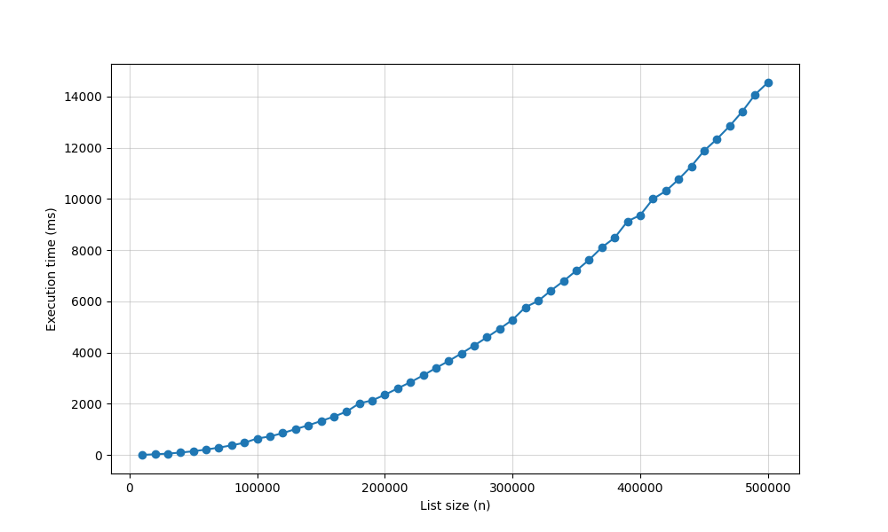
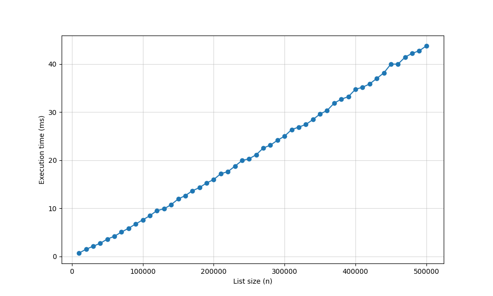
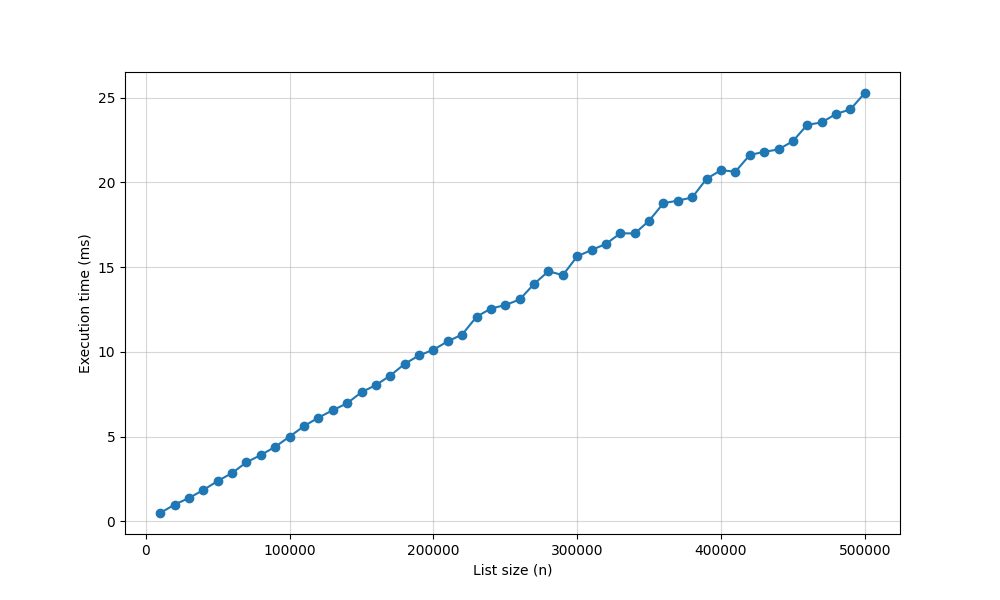

# HW03 Program Homework Report

## Algorithms

- HeapSort
- InsertionSort
- QuickSort

> All algorithms sort in increasing order.

## Method

1.  **Execute Benchmark**: Run the compiled `sort_benchmark` executable.
2.  **Data Extraction**: Copy the terminal output generated by the C++ program.
3.  **Data Storage**: Paste the output directly into `benchmark_output.csv`.
4.  **Visualization**: Execute the `plot_results.py` Python script to generate the performance plots.

## Result

*InsertionSort*

*HeapSort*

*QuickSort*

## Analysis and Discussion

The benchmark results are consistent with theoretical expectations for all three algorithms. InsertionSort shows clear quadratic growth, while HeapSort and QuickSort grow much more slowly. For example, when n increases from 10,000 to 500,000, InsertionSort increases from about 8-10 ms to about 14,700-14,900 ms, which matches O(n^2) behavior in practice.

For HeapSort and QuickSort, the curves look almost linear in the current plotting range, but this does not mean their complexity is O(n). Their theoretical complexity is O(n log n), and over this input range the log n factor grows slowly compared with n. Therefore, the graph can look close to a straight line even though the underlying growth class is still O(n log n).

One important correction is the speed comparison between HeapSort and QuickSort. The measured data shows QuickSort is faster than HeapSort in this implementation. At n = 500000, HeapSort takes about 44.6-44.8 ms, while QuickSort takes about 28.1-28.9 ms. So the statement should be "QuickSort is faster than HeapSort" for this experiment.

This gap is reasonable even though both are O(n log n), because asymptotic notation describes growth trend rather than constant factors. In this code, QuickSort uses median of three pivot selection and a partition loop with strong sequential memory access, which is often cache-friendly. HeapSort uses heapify operations with more branching and non-sequential index movement in the implicit tree (Representing a heap tree using a list), which can add overhead on modern CPUs. As a result, QuickSort can have lower practical runtime while remaining in the same asymptotic class.

In summary, the experiment supports theory: InsertionSort is unsuitable for large n due to O(n^2) growth, while HeapSort and QuickSort scale much better with O(n log n). For this random-data benchmark, QuickSort provides the best observed practical performance.

## Files

1. sort_benchmark.cpp
    - implementation of algorithm and print result in terminal
2. sort_benchmark
    - compiled file of sort_benchmark.cpp
3. benchmark_output.csv
    - copy sort_benchmark execute terminal output and paste to benchmark_output.csv for plot_results.py plotting
4. plot_result.py
    - Use the matplotlib to create a plot based on the CSV file.
    - The output images will be stored in the /plot folder.
5. /plots
    - including plot of each algorithm benchmark result
